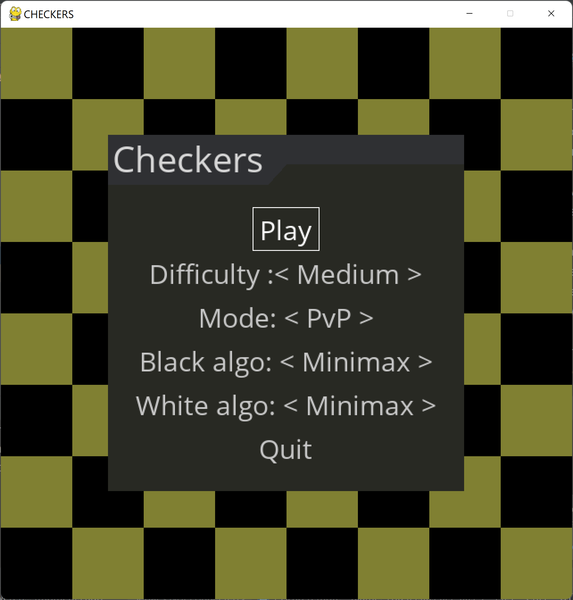

# Checkers

Game of checkers based on [this tutorial](https://youtu.be/vnd3RfeG3NM) made by [Tech With Tim](https://www.youtube.com/c/TechWithTim)

Only the portion of drawing and selecting pieces are taken from tutorial.
Whole menu system, getting valid moves and AI algorithms were rewritten.

Also, the rules are different.

This game follows Polish version of checkers.
The rules are as follows:
- The game is between two players
- The board consists of 64 fields
- Pieces move only on the dark fields
- Pieces move only ahead, and only one field
- You can't move not in your turn
- You can't skip your turn
- When the piece reaches opposite side of the board it becomes king
- Kings move in every direction on the diagonal by as many fields as they wish
- If player can jump enemy piece he has to
- You can jump enemy piece forward or backward
- If by jumping, piece reaches opposite side of the board, it does not become king
- The game end when player has no pieces or can't make a valid move
- If you can jump multiple pieces you have to choose the moves that jumps most pieces

### You have multiple options to choose

**You can:**
- Choose difficulty (depth of algorithm)
- Chose mode
  - Player vs Player
  - Player vs AI
  - AI vs AI 
  - AI vs random
- Choose algorithm used by specific side

In mode AI vs player AI always plays black side.

----
### The game supports multiple jumps, forward or backward as the rule states.

### As a king you can attack first enemy piece from distance.

### At the end screen you can click whereever you want to go back to menu
